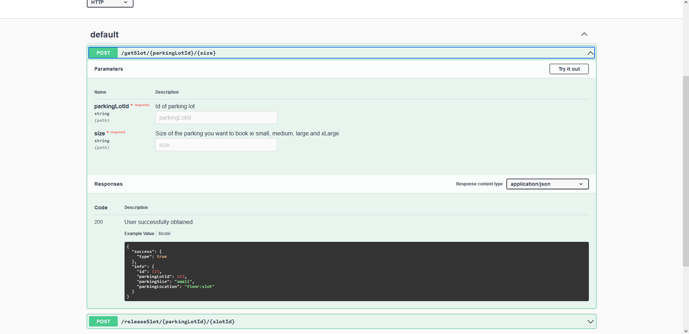

## Pre-requisite
A `postgres` database. I've used a docker setup for [postgres](https://hub.docker.com/_/postgres)

`docker run --name postgres -p 5432:5432 -e POSTGRES_PASSWORD=1234 -d postgres`

You can also change the database configuration inside `config/config.js`.

Run `npm run prefill` to create database, table and prefill the tables.

Run `npm ci` to install packages.

## Available commands
Run `npm run start-dev` to start the server in develop mode.

Run `npm run start` to start the server (You can pass DEBUG=true in environment variable to enable debug logs on console).
Logs will be there inside `./log/app.log`.

Run `npm run test` to run the unit tests.

Run `npm run swagger` to generate new swagger definition if there is any changes in the APIs.

Swagger URL: http://localhost:8080/doc

